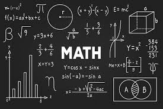

# Mathematics Assignment 4:

## Syllabus

- Unit 2: __Ordinary Differential Equation__
  -  Exact and Non-exact differential equations.

| Content Table |
|:-------:|
| [Question 1](#question-1) |
| [Question 2](#question-2) |
| [Question 3](#question-3) |
| [Question 4](#question-4) |
| [Question 5](#question-5) |
| [Question 6](#question-6) |
| [Question 7](#question-7) |
| [Question 8](#question-8) |
| [Question 9](#question-9) |
| [Question 10](#question-10) |
| [Question 11](#question-11) |
| [Question 12](#question-12) |
| [Question 13](#question-13) |
| [Question 14](#question-14) |
| [Question 15](#question-15) |
| [Question 16](#question-16) |
| [Question 17](#question-17) |
| [Question 18](#question-18) |

### Question 1:

$$(y-x^3)dx + (x+y^3)dy=0$$

### Question 2:

$$(y^2e^{xy^2}+4x^3)dx+(2xye^{xy^2}-3y^2)dy=0$$

### Question 3:

$$(\sin{x}\tan{y}+1)dx+\cos{x}\sec^2{y}dy=0$$

### Question 4:

$$(x^2+y^2-a^2)xdx+(x^2-y^2-b^2)ydy=0$$

### Question 5:

$$y'=\frac{y-2x}{2y-x}\text{ } \text{ ; }\text{ } y(1)=2$$

### Question 6:

$$3x^2ydx+(y^4-x^3)dy=0$$

### Question 7:

$$xdy=(x^5+x^3y^2+y)dx$$

### Question 8:

$$(y^3x^3+1)dx+x^4y^2dy=0$$

### Question 9:

$$2xydy-(x^2+y^2+1)dx=0$$

### Question 10:

$$(3xy-2ay^2)dx+(x^2-2axy)dy=0$$

### Question 11:

$$y^2dx+(x^2-xy-y^2)dy=0$$

### Question 12:

$$(y-x)dx+(y+x)dy=0$$

### Question 13:

$$(xy^3+y)dx+2(x^2y^2+x+y^4)dy=0$$

### Question 14:

$$y(x+y+1)dx + x(x+3y+2)dy=0$$

### Question 15:

$$y(xy+2x^2y^2)dx+x(xy-x^2y^2)dy=0$$

### Question 16:

$$y(1+xy)dx+x(1-xy)dy=0$$

### Question 17:

$$(8ydx+8xdy)+x^2y^3(4ydx+5xdy)=0$$

### Question 18:

$$x^3y^3(2ydx+xdy)-(5ydx+7xdy)=0$$

### Other Assignments:

|[Assignment 1](https;//saksham3736.github.io/mathematics/)|
|:---------------------------------------------------------:|
|[Assignment 2](https://saksham3736.github.io/mathematics3/)|
|[Assignment 3](https://saksham3736.github.io/mathematics2/)|

#### Made by:
- Name: Saksham
- Branch: Computer Science Engineering
- My portfolio: [Saksham](https://saksham3736.github.io)
- Feedback form: [class feedback](https://docs.google.com/forms/d/13BS9Ji-BY5HWP-9HjXCHh__0azu2gyu-lN5q2BheyzM/viewform)
